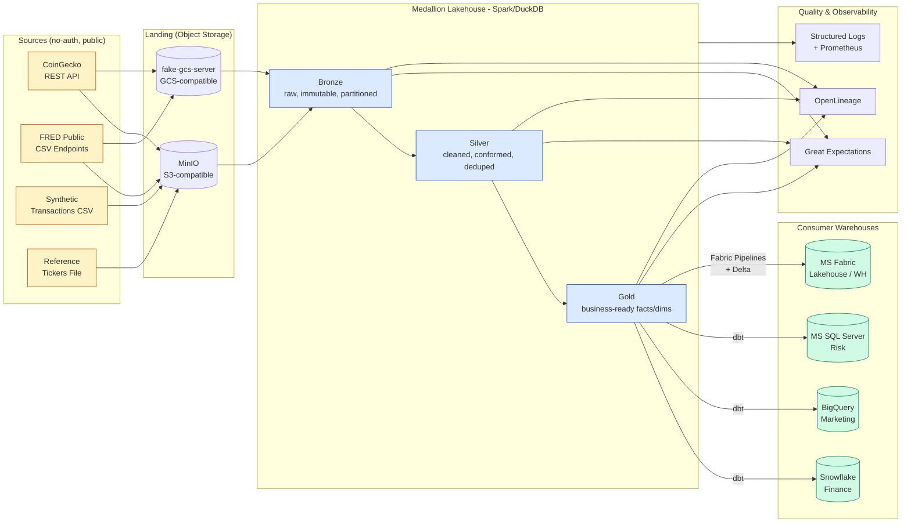

# FinSight: Multi-Cloud Financial & Economic Intelligence Lakehouse

[](.github/workflows/ci.yml)
[](https://www.python.org/)
[](https://www.getdbt.com/)
[](https://airflow.apache.org/)
[](LICENSE)

> **A production-grade, multi-cloud ETL/ELT reference implementation** that ingests open-source financial and macro-economic data through a medallion lakehouse and lands curated marts in **Snowflake, BigQuery, MS SQL Server, and Microsoft Fabric** — orchestrated by Airflow, transformed with dbt, validated with Great Expectations, and instrumented end-to-end.

---

## 1. Why this project exists

Most portfolio pipelines stop at "CSV → Postgres". Real platforms span multiple ingestion patterns, multiple compute engines, and multiple consumer warehouses owned by different teams. **FinSight simulates that complexity faithfully without requiring any paid accounts or proprietary data.**

The narrative: a fictional fintech, *FinSight Analytics*, ingests crypto market data (CoinGecko), macro-economic indicators (FRED public CSVs), reference equity data (synthetic), and a stream of synthetic customer transactions. It exposes curated marts to four downstream consumer warehouses because — like in real life — Finance is on Snowflake, Marketing is on BigQuery, Risk runs MS SQL, and the new Fabric Lakehouse is being stood up for the CTO's exec dashboards.

## 2. Architecture

### 2.1 High-level diagram



### 2.2 Orchestration DAG (logical view)

```
                    ┌────────────────────┐
                    │ master_finsight_dag │  (daily 02:00 UTC)
                    └──────────┬─────────┘
                               │
        ┌──────────────┬───────┴───────┬───────────────┐
        ▼              ▼               ▼               ▼
   ingest_api     ingest_files    ingest_cloud     dq_pre_checks
   (CoinGecko)    (FRED CSVs)     (S3/GCS sync)    (schema, freshness)
        │              │               │               │
        └──────┬───────┴───────────────┘               │
               ▼                                       │
          land_to_bronze ────────────────────────────► │
               │                                       │
               ▼                                       │
          bronze_to_silver  (Spark/DuckDB)             │
               │                                       │
               ▼                                       │
          dq_silver_checks ◄───────────────────────────┘
               │
               ▼
          silver_to_gold (dbt run)
               │
        ┌──────┴──────┬─────────────┬────────────┐
        ▼             ▼             ▼            ▼
   load_snowflake  load_bigquery  load_mssql  load_fabric
        │             │             │            │
        └──────┬──────┴─────────────┴────────────┘
               ▼
          dq_post_checks  →  publish_metrics  →  notify_slack
```

### 2.3 Medallion layers

| Layer  | Purpose                                | Storage             | Format          | Retention |
| ------ | -------------------------------------- | ------------------- | --------------- | --------- |
| Bronze | Raw, immutable, source-faithful        | MinIO/`bronze/`     | Parquet (snappy)| 365 d     |
| Silver | Cleaned, deduped, type-cast, conformed | MinIO/`silver/`     | Delta/Parquet   | 730 d     |
| Gold   | Star-schema facts & dims, SCD2 dims    | Warehouse-native    | Native tables   | Forever   |

## 3. Tech stack

| Concern          | Tool                                             |
| ---------------- | ------------------------------------------------ |
| Orchestration    | Apache Airflow 2.9                               |
| Compute / ELT    | dbt-core 1.7, PySpark 3.5, DuckDB 0.10           |
| Object storage   | MinIO (S3 mock), fake-gcs-server (GCS mock)      |
| Warehouses       | Snowflake, BigQuery, MS SQL Server 2022, Fabric  |
| Data quality     | Great Expectations 0.18                          |
| Lineage          | OpenLineage + Marquez (optional)                 |
| Secrets          | `.env` + `pydantic-settings` (Vault-ready)       |
| Containerisation | Docker Compose                                   |
| CI               | GitHub Actions (lint, unit, integration)         |
| Languages        | Python 3.11, SQL (ANSI + dialect-specific)       |

## 4. Repository layout

```
finsight/
├── README.md                       <- you are here
├── LICENSE
├── .gitignore
├── .env.example                    <- copy to .env; never commit real secrets
├── docker-compose.yml              <- spins up MinIO, fake-gcs, MSSQL, Airflow
├── Makefile                        <- one-command bootstrap
├── requirements.txt
├── pyproject.toml
│
├── docs/
│   ├── architecture.md
│   ├── data-model.md
│   ├── runbook.md
│   └── diagrams/
│
├── config/
│   ├── pipeline_config.yaml        <- declarative pipeline definitions
│   ├── connections.yaml            <- env-var-templated connection strings
│   └── logging.yaml
│
├── airflow/
│   └── dags/
│       ├── master_finsight_dag.py
│       ├── crypto_pipeline_dag.py
│       └── economic_indicators_dag.py
│
├── src/
│   ├── __init__.py
│   ├── ingestion/
│   │   ├── api_extractor.py        <- public REST APIs, retry, paginate
│   │   ├── file_extractor.py       <- CSV/JSON/Parquet local files
│   │   └── cloud_storage_extractor.py  <- S3/GCS mocks
│   ├── transform/
│   │   ├── bronze_to_silver.py     <- PySpark/DuckDB
│   │   └── silver_to_gold.py       <- thin wrapper around dbt
│   ├── loaders/
│   │   ├── snowflake_loader.py
│   │   ├── bigquery_loader.py
│   │   ├── mssql_loader.py
│   │   └── fabric_loader.py
│   ├── quality/
│   │   ├── data_quality_checks.py
│   │   └── expectations/
│   ├── cdc/
│   │   └── incremental_loader.py   <- watermark + merge logic
│   └── utils/
│       ├── logger.py
│       ├── retry.py
│       ├── config_loader.py
│       └── secrets_manager.py
│
├── dbt/
│   ├── dbt_project.yml
│   ├── profiles.yml                <- env-var driven
│   ├── models/
│   │   ├── staging/
│   │   ├── intermediate/
│   │   └── marts/
│   ├── snapshots/                  <- SCD2
│   ├── macros/
│   ├── tests/
│   └── seeds/
│
├── sql/
│   └── ddl/
│       ├── snowflake/
│       ├── bigquery/
│       ├── mssql/
│       └── fabric/
│
├── tests/
│   ├── unit/
│   └── integration/
│
├── data/
│   ├── sample/
│   └── schemas/
│
└── .github/
    └── workflows/
        └── ci.yml
```

## 5. Setup (zero real credentials)

```bash
# 1. Clone & enter
git clone https://github.com/<you>/finsight.git && cd finsight

# 2. Copy the dummy env file – this is the ONLY secrets surface
cp .env.example .env

# 3. Boot local infra (MinIO, fake-gcs, MSSQL, Airflow)
make up

# 4. Install Python deps in a venv
make install

# 5. Seed buckets and dummy warehouses with sample data
make seed

# 6. Trigger the master DAG (or wait for the daily schedule)
make run-pipeline

# 7. Tear everything down
make down
```

> **No real cloud account is ever required to run this project.** Snowflake / BigQuery / Fabric loaders are wired against their official Python SDKs but are guarded by an `EXECUTION_MODE=mock` flag that swaps in local stand-ins (DuckDB for Snowflake/BigQuery semantics, a Parquet sink for Fabric). Switch to `EXECUTION_MODE=live` and provide real creds to point the same code at a real account.

### 5.1 Credentials pattern

Real-world secret injection is demonstrated three ways, in order of preference:

1. **Cloud-native secret manager** (AWS Secrets Manager / GCP Secret Manager / Azure Key Vault) — see `src/utils/secrets_manager.py` for the abstraction.
2. **Airflow Connections** with backend = secret manager.
3. **Environment variables** sourced from `.env` (local dev only).

`.env.example` ships with **placeholder** values clearly marked `REPLACE_ME`. The CI lints the repo to ensure no real secret pattern (AKIA…, ASIA…, sk-…, etc.) is ever committed.

## 6. Example outputs

After a successful run, the lakehouse contains:

| Object                                  | Rows (sample run) | Layer  |
| --------------------------------------- | ----------------: | ------ |
| `bronze.coingecko_market_chart`         |          ~150,000 | Bronze |
| `bronze.fred_macro_indicators`          |           ~60,000 | Bronze |
| `bronze.synthetic_transactions`         |        ~1,000,000 | Bronze |
| `silver.crypto_prices_daily`            |           ~50,000 | Silver |
| `silver.macro_indicators_clean`         |           ~30,000 | Silver |
| `gold.fct_daily_market_metrics`         |           ~25,000 | Gold   |
| `gold.dim_asset` (SCD2)                 |              ~500 | Gold   |
| `gold.fct_customer_transaction_summary` |           ~10,000 | Gold   |

Sample query against the Gold mart in **any** of the four warehouses:

```sql
SELECT
    d.asset_symbol,
    f.trade_date,
    f.close_usd,
    f.volume_usd,
    f.daily_return_pct,
    f.rolling_30d_volatility
FROM gold.fct_daily_market_metrics f
JOIN gold.dim_asset d USING (asset_key)
WHERE d.asset_class = 'CRYPTO'
  AND f.trade_date >= CURRENT_DATE - INTERVAL '30 day'
ORDER BY d.asset_symbol, f.trade_date;
```

## 7. Advanced features

### 7.1 Incremental loads & CDC

* **High-watermark pattern** for append-mostly sources (FRED, CoinGecko). State persisted in `meta.ingestion_watermarks`.
* **MERGE/UPSERT** for mutable sources, dialect-aware (`MERGE` on Snowflake/MSSQL/Fabric, `MERGE` on BigQuery, `INSERT ... ON CONFLICT` fallback).
* **SCD Type 2** dimensions via dbt snapshots (`dbt/snapshots/dim_asset_snapshot.sql`).
* See `src/cdc/incremental_loader.py` for the reusable strategy class.

### 7.2 Data quality

* **Schema contracts** enforced at Bronze (Pandera/PyArrow schema).
* **Great Expectations** suites at Silver and Gold; failures raise an Airflow `AirflowFailException` and are surfaced via Slack.
* **dbt tests**: `not_null`, `unique`, `accepted_values`, plus custom singular tests for referential integrity and freshness.
* DQ run results are persisted into `meta.dq_results` so trends are queryable.

### 7.3 Observability

* **Structured JSON logs** (`structlog`) with correlation_id per DAG run.
* **OpenLineage** events emitted from Airflow tasks → Marquez (optional).
* **Prometheus** metrics: rows ingested, bytes scanned, latency, DQ failures.
* **Slack alerting** on task failure with task log URL + last 50 lines.

### 7.4 Cost & performance

* **Partition pruning**: Bronze partitioned by `ingestion_date` and `source_system`.
* **Micro-batching**: API extractors batch and back off; CSV loaders stream via PyArrow chunks.
* **Right-sizing**: dbt models tagged `incremental`, `view`, or `table` based on size/refresh tradeoff.
* **Snowflake**: warehouses sized XS for ingestion, S for marts, with auto-suspend <= 60 s.
* **BigQuery**: clustering on `trade_date, asset_symbol` to keep slot-hours predictable.
* **Compute push-down**: heavy aggregations live in dbt (warehouse compute) rather than Python.

### 7.5 Scalability path

| Stage          | Today (this repo)            | Production scale path                              |
| -------------- | ---------------------------- | -------------------------------------------------- |
| Ingestion      | Python + asyncio, 1 worker   | Kafka / Kinesis + Spark Structured Streaming      |
| Bronze->Silver | DuckDB / single-node Spark   | Spark on EMR/Dataproc/Fabric Spark, autoscaling   |
| Orchestration  | Single Airflow scheduler     | Airflow on K8s with `KubernetesExecutor`          |
| Gold marts     | dbt-core, single project     | dbt Cloud / dbt-mesh, multi-project, CI gated     |
| Catalog        | dbt docs                     | OpenMetadata / DataHub                             |
| Lineage        | OpenLineage local            | Marquez/Atlan/Collibra                             |

## 8. Testing

```bash
make test               # unit tests
make test-integration   # spins ephemeral docker stack
make dbt-test           # data tests
make ge-validate        # Great Expectations
```

CI runs all of the above on every PR.

## 9. Screenshots & diagrams

Placeholders — replace with real screenshots once you run the stack:

| File                                  | Description                          |
| ------------------------------------- | ------------------------------------ |
| `docs/diagrams/airflow-dag.png`       | DAG graph view                       |
| `docs/diagrams/lineage.png`           | Marquez lineage UI                   |
| `docs/diagrams/dbt-docs.png`          | dbt docs site rendered               |
| `docs/diagrams/ge-data-docs.png`      | Great Expectations Data Docs         |
| `docs/diagrams/fabric-lakehouse.png`  | Fabric Lakehouse SQL endpoint        |

## 10. License

MIT — see [LICENSE](LICENSE).

---

*Built as a public reference for a senior data engineering portfolio. Feedback and PRs welcome.*
